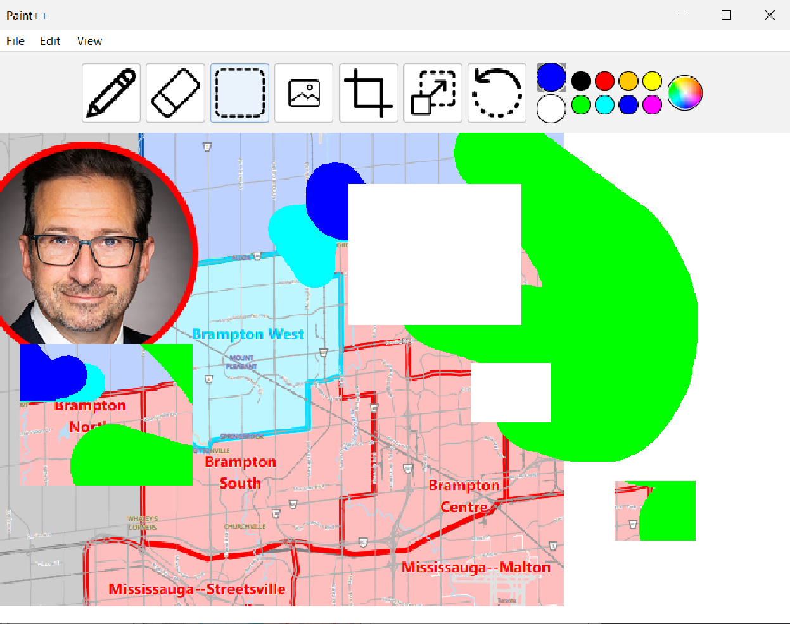

---

## Projects

{: .notice}
This version of my projects page is unfinished, so please look through [this old version of the website instead] to see a more complete preview of my work. \
To see a preview of my resume, click [here](./resumepreview.html).

### **Paint++**
[**CSC207 Project**](https://github.com/ecorbin567/paintplusplus) \
Jul - Aug 2025

This is my group's submission for our summer CSC207H1 class which we have just recently wrapped up. It's a recreation of Microsoft Paint but with integrated accounts and document storage like in Google Docs.

I worked primarily on the latter features. We used a Supabase database to store and access user account/file storage data. 

{: .figure}

**A very messy screenshot of the drawing view. Thanks to our TA for really liking the project.**

---

## Work experience
### **Audiovisual Team**
**Every Nation** \
Jun 2021 - Present \
I've been doing this one for a while. I do audio visual work here. I've always had a passing interest in photography and videography, which combines well with my love for tech in my activities here.

### **Youth In Policing Initiative**
**Peel Regional Police** \
Jul 2023 - Aug 2023 \
I thought this was pretty fun. It was a nice opportunity to work for the police and get paid as a high schooler, while we got an inside look into parts of their operations the public doesn't normally see.

### **Peer Tutor**
**St. Roch Catholic Secondary School** \
Mar 2022 - Jun 2024 \
I used to work as a tutor for younger students at my school. I taught math, physics, and French.

## Achievements and awards
I'm pretty proud of these, although most of these are from high school.
- University of Toronto Scholars Award
- Governor General's Academic Award
- [2024 DPCDSB Top Ontario Scholar]

----
[2024 DPCDSB Top Ontario Scholar]: assets/misc/2024DPCDSBTopScholars.pdf
[this old version of the website instead]: https://jeodn.github.io/website-me/